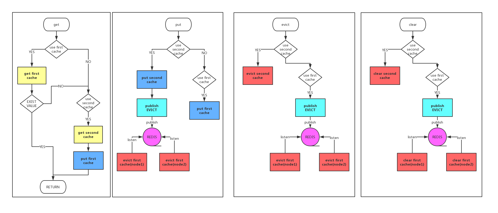
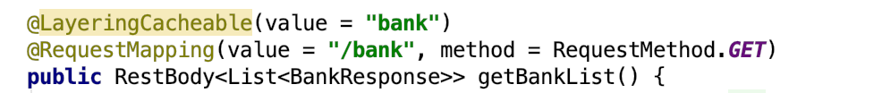
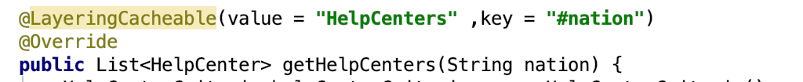
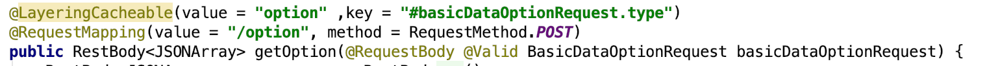
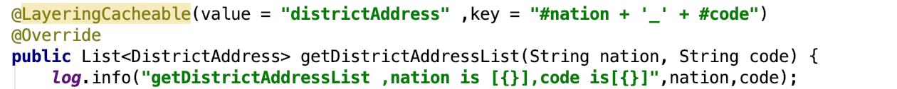
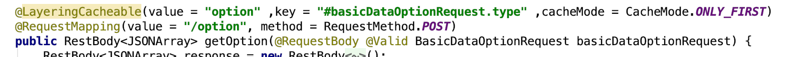
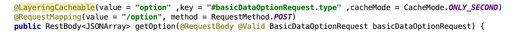
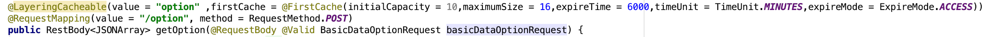
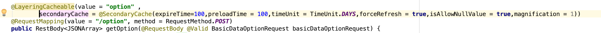

# 目的
* 给数据库减压
* 针对不同活跃度数据，灵活使用一级、二级缓存

# 原理
* spring cache 流程

* 多级缓存流程


# 使用
#### 启用spring cache
* 引入组件（以gradle为例）
```groovy
compile("com.nadia.cache:nadia-cache:1.0.0-RELEASE")
```

* 代码集成
```java
在方法头部引入 @LayeringCacheable 注解
```

* 简单使用 通常情况下简单的引入多级缓存（默认为同时使用一级二级缓存）
1. 无参缓存


2. 带参缓存1


3. 带参缓存2


4. 组合参数缓存


* 高级使用
1. 只启用一级缓存（数据量比较大的情况下推荐只是用一级缓存）


2. 只启用二级缓存（需要考虑缓存的可用性时推荐只用二级缓存）


3. 一级缓存相关配置


4. 二级缓存相关配置

